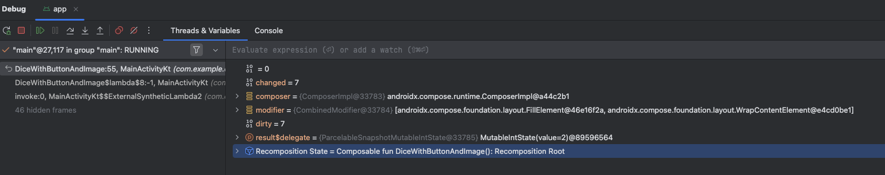

# [学習した項目・単語名]

## 🗓 日付
2026-03-08


## 参考URL
- [Jetpack Composeの状態](https://developer.android.com/codelabs/jetpack-compose-state?hl=ja#0)
- [Android Studioのデバッガを使用する](https://developer.android.com/codelabs/basic-android-kotlin-compose-intro-debugger?hl=ja#0)

## 💡 学んだこと（要約）
### 1. デバッガの使い方
  - よくわからん「changed」と「dirty」が出てきてる <br>
    
    これ調べてみると <br>
    `changed`：ビットフラグという数値のこと。changedフラグが「変更無し」状態であればこの関数の中身は実行しないで飛ばす、変更があるときだけ再コンポーズする。 <br>
    `dirty`：関数の内部状態や親から受け取った受け取った変更情報を子のコンポーザブルへ伝える役割 <br>
    `changed`と`dirty`はセットで使われ、`changed`が変更を検知するためのフラグ、`dirty`がどのコンポーザブルを再コンポーズするかを判断している。 <br>
    パフォーマンスの改善時に確認する事項なので、初級者は今のところ大きく意識をする必要は無さそう... <br>
    ただ、こういうことをしているんだという意識は持っておいたほうが後々楽になるかも

### 2. 「lemonade」のコーディング
【課題に思っていること】
  - Modifierで何が設定できるのか十分に理解していない
  - AlignmentとArrangementの区別がついていない
  - whenのelseに `-> {}`を入れるとUnit型になって代入元がany型になってしまう
  - AppBarを使いたければScaffoldを使うこと
  - LaunchedEffctはKeyが変わると再コンポーズしてくれるコンポーザブルだとわかった。

## 💻 コード例 / 使い方
```kotlin
@OptIn(ExperimentalMaterial3Api::class)
@Composable
fun LemonApp() {
    var result by remember{ mutableStateOf(1) }
    var tapCount by remember { mutableStateOf(0) }

    LaunchedEffect(result) {
        if (result == 2) {
            tapCount = (2..4).random()
        }
    }

    val lemonImage = when (result) {
        1 -> R.drawable.lemon_tree
        2 -> R.drawable.lemon_squeeze
        3 -> R.drawable.lemon_drink
        4 -> R.drawable.lemon_restart
        else -> {R.drawable.lemon_tree}
    }
    val lemonText = when (result) {
        1 -> R.string.lemon_tree
        2 -> R.string.squeeze_lemon
        3 -> R.string.lemonade
        4 -> R.string.restart
        else -> {R.string.lemon_tree}
    }
    Scaffold(
        topBar = {
            CenterAlignedTopAppBar(
                title = {
                    Text(
                        text = stringResource(R.string.app_name),
                        style = MaterialTheme.typography.headlineMedium,
                    )
                },
                colors = TopAppBarDefaults.centerAlignedTopAppBarColors(
                    containerColor = Color(0xFFF8DF4C)
                ),
                modifier = Modifier
                    .fillMaxWidth(),
            )
        }
    ) { innerPadding ->
        Column(
            modifier = Modifier
                .padding(innerPadding)
                .fillMaxSize(),
            horizontalAlignment = Alignment.CenterHorizontally,
            verticalArrangement = Arrangement.Center,
        ) {
            Image(
                painter = painterResource(lemonImage),
                contentDescription = stringResource(lemonText),
                modifier = Modifier
                    .clip(RoundedCornerShape(20.dp))
                    .background(color = Color(0xFFCBEBD4))
                    .border(
                        width = 2.dp,
                        color = Color(0xFFCBEBD4),
                        shape = RoundedCornerShape(20.dp)
                    )
                    .clickable(
                        interactionSource = remember { MutableInteractionSource() },
                        indication = null
                    ) {
                        if (result == 2) {
                            tapCount -= 1
                            if (tapCount == 0) {
                                result = 3
                            }
                        } else {
                            result = if (result < 4) result + 1 else 1
                        }
                    }
                    .padding(16.dp),
            )
            if (result == 2) {
                Text("Tap agein! ($tapCount more time)")
            }
            Spacer(modifier = Modifier.height(16.dp))

            Text(
                text = stringResource(lemonText),
                fontSize = 18.sp,
            )
        }
    }
}
```